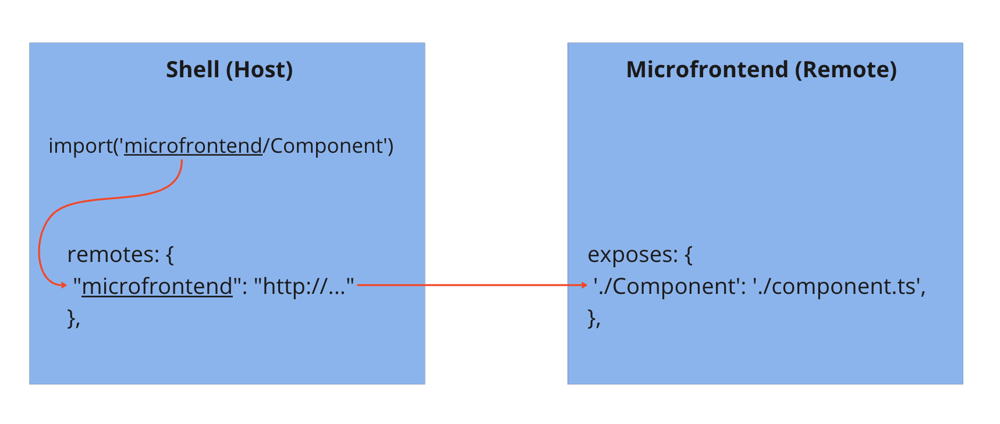

# Angular Vertical Microfrontend Demo

This repository contains a demo project showcasing the use of Webpack Module Federation in Angular. The project is divided into two parts:
1. **shell** - This is the main application responsible for loading the microfrontend at runtime.
2. **angular-microfrontend** - This is the microfrontend application that gets loaded into the shell.


## Description

The purpose of this demo is to illustrate how Webpack's Module Federation can be used to dynamically load and share code between multiple applications at runtime. 
The `shell` project serves as the host application, while the `angular-microfrontend` project acts as a microfrontend that gets loaded into the shell.

For a detailed explanation of the process that led to the creation of this project, check out my [Medium article](https://medium.com/@mattia.darge/build-a-microfrontend-with-module-federation-a-vertical-application-with-angular-e8080989454f).



### Why Not NX?

In this demo, NX was deliberately not used as a monorepo tool to maintain a complete focus on Module Federation without the additional components that NX introduces. 
This allows for a clearer understanding of how Module Federation works in isolation.


## Getting Started

To run the demo, you need to start both the `shell` and `angular-microfrontend` projects. Follow the steps below:


### Prerequisites

Make sure you have the following installed on your machine:
- Node.js
- Angular CLI


### Installation

1. Clone the repository:
   ```sh
   git clone https://github.com/your-username/your-repo.git
   cd your-repo
   ```

2. Install dependencies for both projects:
    ```sh
    cd shell
    npm install
    cd ../angular-microfrontend
    npm install
    ```


### Running the Projects

1. Start the `shell` project:
    ```sh
    cd shell
    ng serve --port=4200
    ```

2. Start the `angular-microfrontend` project:
    ```sh
    cd angular-microfrontend
    ng serve --port=4201
    ```


## Accessing the Demo
Once both projects are running, open your browser and navigate to http://localhost:4200/angular-hello?name=foo. 
The shell application will be loaded, and the microfrontend will be fetched and rendered at runtime.
